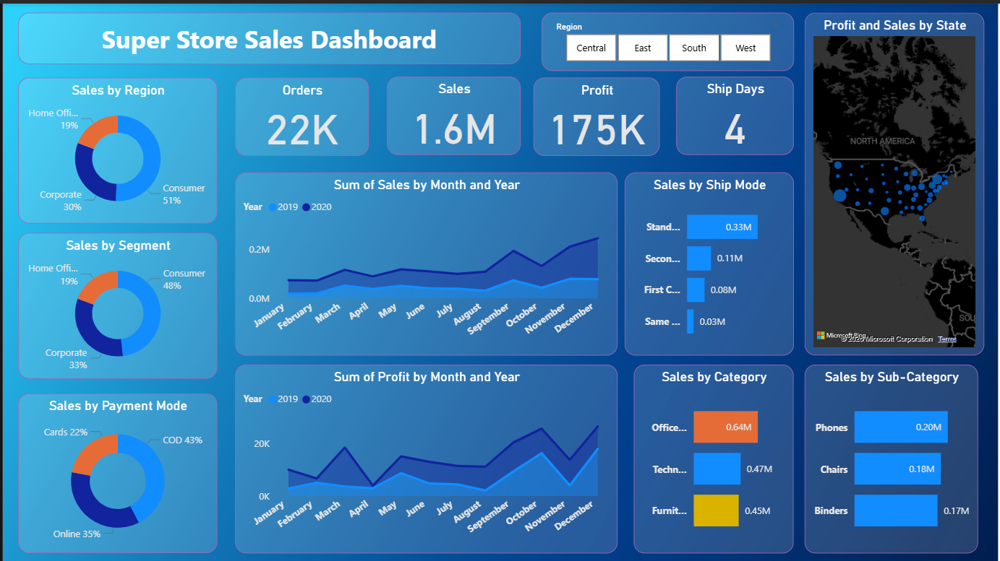
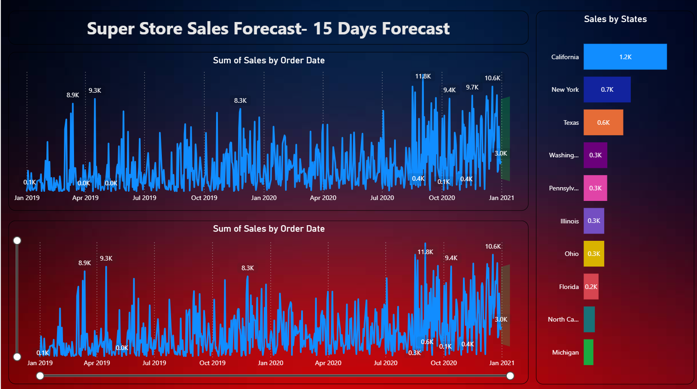

# 📊 Super Store Sales Dashboard | Power BI

An interactive **Power BI project** focused on analyzing Super Store sales performance and supporting **short-term decision making** using a **15-day sales forecast**.

---

## 🚀 Project Overview

This project includes **two dashboards**:

1. **Super Store Sales Performance Dashboard** – Historical sales analysis  
2. **Sales Forecast Dashboard** – Short-term sales prediction  

---

## 📊 Dashboard 1: Super Store Sales Performance Dashboard

Provides an overview of sales performance across time, region, products, customers, and shipping behavior.

### 🔹 Key Features

- **KPIs:** Sales, Profit, Orders, Avg. Ship Days  
- **Trends:** Monthly & year-wise sales analysis  
- **Geography:** Region-wise and state-wise performance  
- **Products:** Category & sub-category sales  
- **Customers & Shipping:** Segment-wise sales, ship modes, payment modes  

### 📷 Dashboard Preview



---

## 📈 Dashboard 2: Sales Forecast Dashboard (15-Day Forecast)

Focuses on short-term predictive analysis using historical sales data.

### 🔹 Key Features

- Historical sales trend  
- **15-day sales forecast** using time-series analysis  
- Confidence intervals for forecast accuracy  

### 📷 Dashboard Preview



---

## 🛠 Tools & Technologies

- Power BI Desktop  
- DAX (calculated measures)  
- Data Modeling  
- Time-Series Forecasting  

---

## 📂 Dataset

- Super Store Sales Dataset  
- Includes order details, sales, profit, products, customers, shipping, and dates  

---

## 📁 Repository Structure
```
Super-Store-Sales-Dashboard/
│
├── data/
│ └── SuperStore_Sales.csv # Raw dataset used for analysis
│
├── images/
│ ├── sales_dashboard.png # Sales dashboard preview image
│ └── forecast_dashboard.png # Forecast dashboard preview image
│
├── README.md # Project documentation
└── LICENSE # MIT License
```
---

## 📜 License

This project is licensed under the **MIT License**.  

---
